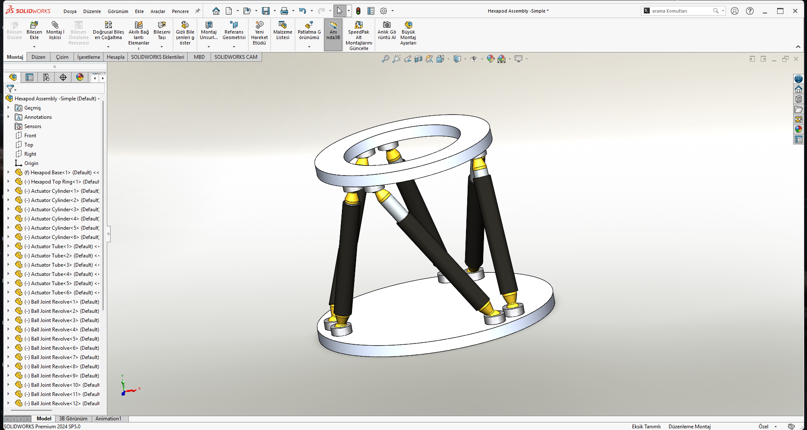

# 🚀 6-DOF Stewart Platform (Hexapod) - Multibody Dynamics Simulation

## 📌 Overview
This project demonstrates the design, assembly, and dynamic simulation of a 6 Degree-of-Freedom (6-DOF) Stewart Platform (Hexapod). The mechanical structure was initially designed in **SolidWorks** and successfully imported into **MATLAB / Simscape Multibody** for closed-loop kinematics and dynamic motion analysis.

### 📸 CAD Design & Simulation

  
    
  <video src="Media/simulation.mp4" width="600" controls="controls" autoplay loop></video>

## ⚙️ Key Features & Engineering Approach
* **CAD to Simscape Integration:** Accurate transfer of mass, center of gravity, inertia, and joint constraints from SolidWorks to MATLAB environment.
* **Closed-Loop Kinematics:** Managing complex spherical and prismatic joint relations in a highly constrained closed kinematic chain.
* **Singularity Avoidance (Trajectory Planning):** Stewart platforms are highly susceptible to kinematic singularities (mechanical locking) if the rigid top plate is forced into impossible geometries. To prevent this, a **Frequency Shift** control strategy was implemented. By assigning slightly different frequencies (e.g., 1.0 Hz to 2.0 Hz) to the sine wave inputs of each linear actuator, the platform achieves a smooth, continuous 6-axis vortex motion (combining Pitch, Roll, Yaw, and Heave) without breaking the physical constraints of the rigid top plate.

## 📂 Repository Structure
* `/CAD_Files` : Contains the original SolidWorks parts and assembly files.
* `/Simulink_Model` : Contains the `.slx` MATLAB/Simulink model with Simscape blocks.
* `/Media` : Contains screenshots and simulation video.

## 🚀 How to Run
1. Clone this repository to your local machine.
2. Open MATLAB and navigate to the `/Simulink_Model` directory.
3. Open the `HexapodAssembly_Simple.slx` file.
4. Click on the **Run** button in Simulink. The Simscape Mechanics Explorer window will pop up automatically to display the 3D simulation.

## 🛠️ Software Used
* **SolidWorks 2024** (Mechanical Design & Assembly)
* **MATLAB / Simulink** (Control & Logic)
* **Simscape Multibody** (Dynamic Physics Simulation)

---
*Designed and simulated by Çağan Güven.*
